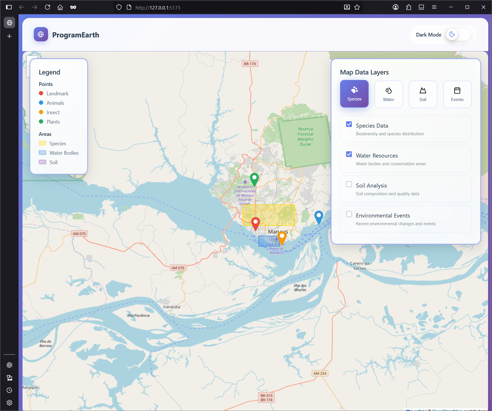

# Map Dashboard Frontend

A modern, interactive map dashboard built with React and Vite. This project provides a user-friendly interface for visualizing and interacting with geospatial data layers.



## Features

- Interactive map visualization (placeholder, ready for integration)
- Layer controls for toggling map data
- Custom UI components (Button, CheckBox)
- Responsive layout and styling
- Mock data for development and testing
- Modular component structure

## Prerequisites

- Node.js (v18 or higher recommended)
- pnpm (v9 or higher)

## Installation

1. Clone the repository:
   ```sh
   git clone https://github.com/OpenSourceFellows/map-dashboard.git
   cd map-dashboard
   ```
2. Install dependencies:
   ```sh
   pnpm install
   ```

## Development

To start the development server:

```sh
pnpm run dev
```

The app will be available at `http://localhost:5173` by default.

## Project Structure

```
main/
├── public/           # Static assets
├── src/              # Source code
│   ├── components/   # UI and map components
│   ├── data/         # Mock data
│   ├── hooks/        # Custom React hooks
│   ├── styles/       # CSS files
│   ├── types/        # TypeScript types
│   ├── App.tsx       # Main app component
│   └── main.tsx      # Entry point
├── package.json      # Project metadata and scripts
├── vite.config.ts    # Vite configuration
└── README.md         # Project documentation
```

## Tools & Libraries

- [React](https://react.dev/) – UI library
- [Vite](https://vitejs.dev/) – Fast build tool
- [TypeScript](https://www.typescriptlang.org/) – Type safety
- [ESLint](https://eslint.org/) – Linting

## Custom Components

- `Header` – App title and navigation
- `MapContainer` – Map area and controls
- `LayerControls` – Toggle map layers
- `MapLegend` – Map legend
- `Button` & `CheckBox` – UI elements

## How to Contribute

[CONTRIBUTING.md](CONTRIBUTING.md)

## License

[LICENSE.md](LICENSE.md)
